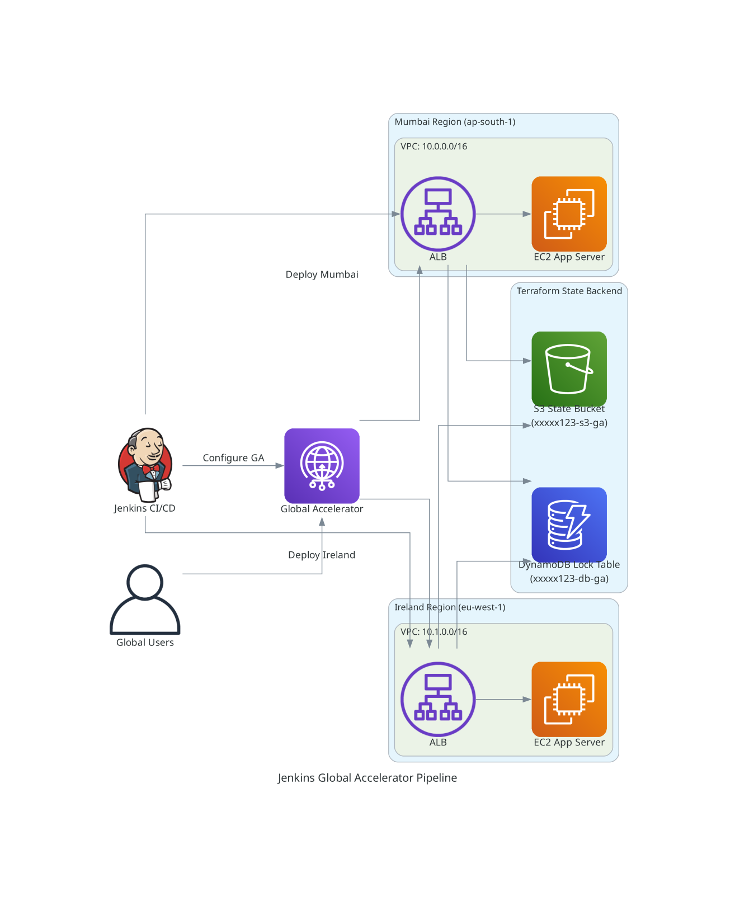

# Jenkins Execution: AWS Global Accelerator (Terraform)

## Goal

Automate the deployment of a **globally distributed, multi-region infrastructure** using **Jenkins CI/CD pipeline** and **Terraform Infrastructure-as-Code**. The solution provisions Application Load Balancers across Mumbai (ap-south-1) and Ireland (eu-west-1) regions, then orchestrates AWS Global Accelerator to intelligently route user traffic to the nearest healthy endpoint, ensuring low-latency, high-availability access. All infrastructure state is managed centrally via S3 backend with DynamoDB distributed locking for safe concurrent deployments.


Architecture





## Overview

This project runs a **Jenkins pipeline** to provision a **multi-region setup** and then front it with **AWS Global Accelerator**.

It applies Terraform in this order:

1. Mumbai regional stack
2. Ireland regional stack
3. Global Accelerator stack (reads both regional ALB ARNs)

Destroy runs in reverse order.

## Repo layout

- `Jenkinsfile`: Jenkins pipeline (apply/destroy switch via parameter)
- `holding-3-tf-folders/`
  - `mumbai/`: VPC + EC2 + ALB (region: `ap-south-1`)
  - `ireland/`: VPC + EC2 + ALB (region: `eu-west-1`)
  - `accelerator-file/`: Global Accelerator; reads remote state from S3 (`accelerator.tf`)
  - `deploy.sh`: local helper script (optional)

## Prerequisites

- Jenkins with a Linux agent that has:
  - Terraform installed
  - AWS CLI configured (or AWS credentials injected)
- AWS account permissions to create VPC/EC2/ALB/Global Accelerator

## Jenkins pipeline usage

### Apply (default)

- Run the pipeline with `DESTROY_MODE = false`.
- Pipeline stages:
  - `Apply - Mumbai` → init/plan/apply
  - `Apply - Ireland` → init/plan/apply
  - `Apply - Accelerator` → init/plan/apply

### Destroy

- Run the pipeline with `DESTROY_MODE = true`.
- Pipeline stages:
  - `Destroy - Accelerator` → destroy
  - `Destroy - Ireland` → destroy
  - `Destroy - Mumbai` → destroy

## Important: Remote state for Accelerator

The file `holding-3-tf-folders/accelerator-file/accelerator.tf` reads state from S3:

- Bucket: `xxxxx123-s3-ga`
- DynamoDB table: `xxxxx123-db-ga`
- Keys:
  - `mumbai/terraform.tfstate`
  - `ireland/terraform.tfstate`

So you must ensure:

1) S3 + DynamoDB backend exists (see `s3-dynamo-state-file.tf` files)
2) The Mumbai and Ireland stacks are using that backend and writing state to those keys

## Run locally (optional)

If you want to run without Jenkins:

```bash
cd /home/dom/jenkins-CI-CD-pipeline/global-acce-jenkin-parent-folder/jen-GA-execution/holding-3-tf-folders
chmod +x deploy.sh
./deploy.sh
```

Or manual order:

```bash
cd /home/dom/jenkins-CI-CD-pipeline/global-acce-jenkin-parent-folder/jen-GA-execution

cd holding-3-tf-folders/mumbai && terraform init && terraform apply -auto-approve && cd ../..
cd holding-3-tf-folders/ireland && terraform init && terraform apply -auto-approve && cd ../..
cd holding-3-tf-folders/accelerator-file && terraform init && terraform apply -auto-approve && cd ../..
```

## Troubleshooting

- **Accelerator apply fails**: confirm Mumbai/Ireland ALB ARN outputs exist and remote state is accessible.
- **Jenkins agent can’t run terraform**: install Terraform on the agent and ensure it’s in `PATH`.
- **Credentials errors**: verify Jenkins has AWS creds and correct region access.
